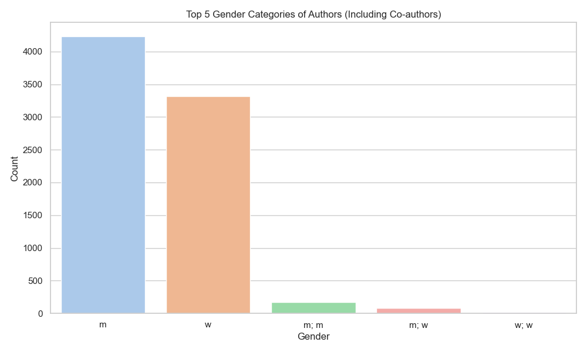
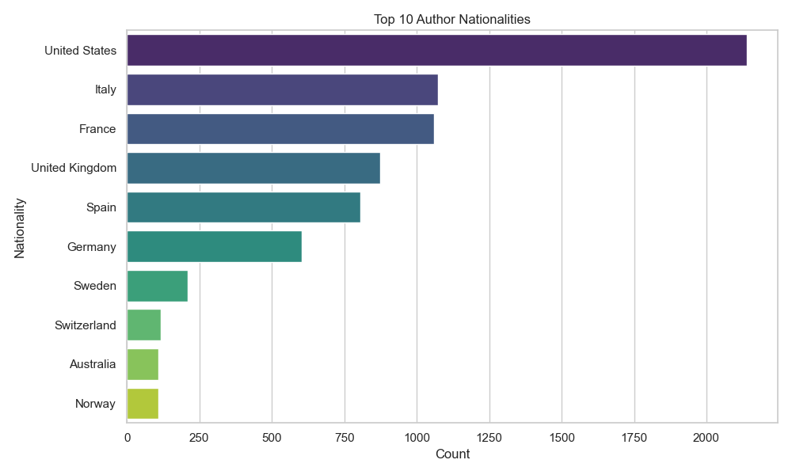
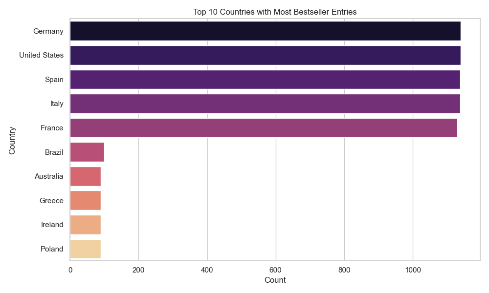
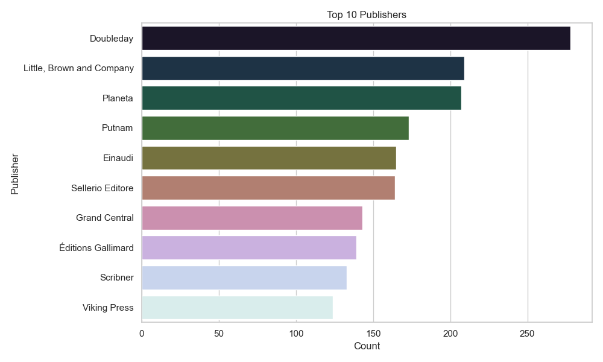

# Exploratory Data Analysis: International Bestsellers

## Overview

This report presents an exploratory data analysis (EDA) of the `international_bestsellers.csv` dataset. The dataset tracks books that appeared on bestseller lists across multiple countries over a multi-year period. The analysis is structured in two parts:

1. **Data Preprocessing** — what the raw data looked like and what cleaning was required.
2. **Basic Statistics & Insights** — key findings about books, authors, nationalities, publishers, and countries.

---

## Part 1: Data Preprocessing

### 1.1 Loading the Data

The dataset was loaded using `pandas`. It contains the following 10 columns:

| Column | Description |
|---|---|
| `date` | Month/year of the bestseller entry |
| `country` | Country whose bestseller list the book appeared on |
| `rank` | Rank on the list |
| `title` | Book title |
| `author` | Author name(s) |
| `nationality` | Author's nationality (may include multiple, separated by `; `) |
| `gender` | Author's gender (may include multiple values like `m;w` for co-authored books) |
| `entry_id` | Unique identifier for the entry |
| `publisher` | Publisher name |
| `publication_country` | Country where the book was published |

### 1.2 Missing Values

Upon initial inspection, the dataset contained missing values in two columns:

| Column | Missing Values |
|---|---|
| `nationality` | 10 |
| `gender` | 10 |
| `publisher` | 2 |
| All others | 0 |

These 10 rows appeared to correspond to books where author metadata (nationality and gender) was unavailable — likely due to anonymous authorship or data collection gaps. The 2 rows missing a publisher likely reflect self-published or otherwise unlisted books.

### 1.3 Cleaning Strategy

Given the small number of missing values (12 out of ~7,900 rows, or less than 0.2%), the decision was made to **drop all rows containing any null values**. This is a minimal loss of data and avoids imputation errors that could distort distributions of categorical fields like `gender` or `nationality`.

After dropping nulls, the clean dataset contains **7,897 rows** and **10 columns**.

### 1.4 Notes on Multi-Value Fields

Two columns require special attention during analysis:

- **`nationality`**: Some entries contain multiple nationalities separated by `; `, reflecting books with multiple authors of different origins, or authors with dual nationality. To count these fairly, the field is split and exploded before computing nationality frequencies.

- **`gender`**: Combined gender strings such as `m;w` indicate co-authored books with authors of different genders. These are treated as distinct categories rather than being broken apart, since they represent a genuine co-authorship dynamic. The top 5 gender categories are used for visualization.

---

## Part 2: Basic Statistics & Insights

### 2.1 Dataset at a Glance

| Metric | Value |
|---|---|
| Total rows (after cleaning) | 7,897 |
| Time period covered | June 2013 – December 2022 |
| Unique authors | 1,843 |
| Unique book titles | 3,743 |
| Unique publishers | 746 |
| Unique countries (list source) | 45 |

The dataset spans nearly a decade of international bestseller lists, covering 45 countries. With nearly 1,843 distinct authors and 3,743 distinct titles, it provides a rich view of cross-country reading trends.

### 2.2 Top Authors by Appearances

The most prolific authors in terms of bestseller list appearances:

| Author | Appearances |
|---|---|
| Elena Ferrante | 120 |
| Stephen King | 87 |
| Joël Dicker | 87 |
| John Grisham | 84 |
| Guillaume Musso | 80 |
| Paula Hawkins | 77 |
| Ken Follett | 74 |
| Jojo Moyes | 74 |
| Andrea Camilleri | 70 |
| Delia Owens | 59 |

Elena Ferrante dominates the list with 120 appearances, notably far ahead of other authors. Her pseudonymous identity and strongly internationalized readership (particularly in Europe) likely drive this.

### 2.3 Top Titles by Appearances

| Title | Appearances |
|---|---|
| The Girl on the Train | 62 |
| My Brilliant Friend | 61 |
| Where the Crawdads Sing | 60 |
| All the Light We Cannot See | 37 |
| Origin | 36 |
| Fresh Water for Flowers | 34 |
| The Midnight Library | 27 |
| Homeland | 26 |
| The Goldfinch | 25 |
| The Evening and the Morning | 24 |

These are the blockbuster titles that crossed country lines — appearing on many national lists simultaneously. Notably, *The Girl on the Train* and *My Brilliant Friend* nearly tie at the top.

### 2.4 Gender Distribution of Authors

The chart below shows the top 5 gender categories found across all entries. Since many entries involve co-authored books, combined codes like `m;w` appear as a separate category.

Male authors dominate the bestseller lists, which is consistent with broader publishing industry research. However, female authors and mixed-gender co-author pairs also have significant representation.

### 2.5 Top Author Nationalities

The `nationality` field was split on `; ` and exploded to count each nationality individually.

| Nationality | Count |
|---|---|
| United States | 2,139 |
| Italy | 1,074 |
| France | 1,061 |
| United Kingdom | 875 |
| Spain | 807 |
| Germany | 604 |
| Sweden | 209 |
| Switzerland | 118 |
| Australia | 110 |
| Norway | 109 |

American authors account for the largest share of entries by far. This reflects both the sheer output of the US publishing industry and its global cultural reach. European countries (Italy, France, UK, Spain, Germany) collectively form a strong second tier.

### 2.6 Countries with Most Bestseller Entries

This chart reflects which national lists contributed the most entries to the dataset — in other words, which countries' bestseller lists are most heavily represented.

This gives insight into the geographic scope of data collection: some countries contribute more entries due to longer list histories, more frequent updates, or broader list lengths.

### 2.7 Top Publishers

The publisher landscape is dominated by large multinational houses, which is expected given the international reach required to appear on multiple countries' bestseller lists simultaneously. Smaller or regional publishers are less likely to achieve multi-country penetration.

---

## Summary

The `international_bestsellers.csv` dataset is a high-quality, near-complete record of bestseller appearances across 45 countries from 2013 to 2022. After minimal cleaning (dropping ~12 rows with missing author metadata), the data is ready for deeper analysis.

Key takeaways from the EDA:
- **American and European authors dominate** international bestseller lists.
- **A small set of titles** appear on many national lists simultaneously, suggesting strong cross-border appeal.
- **Male authors** appear more frequently, though female and co-authored entries are well represented.
- **Large publishers** are overrepresented, reflecting the role of global distribution networks in achieving international reach.
